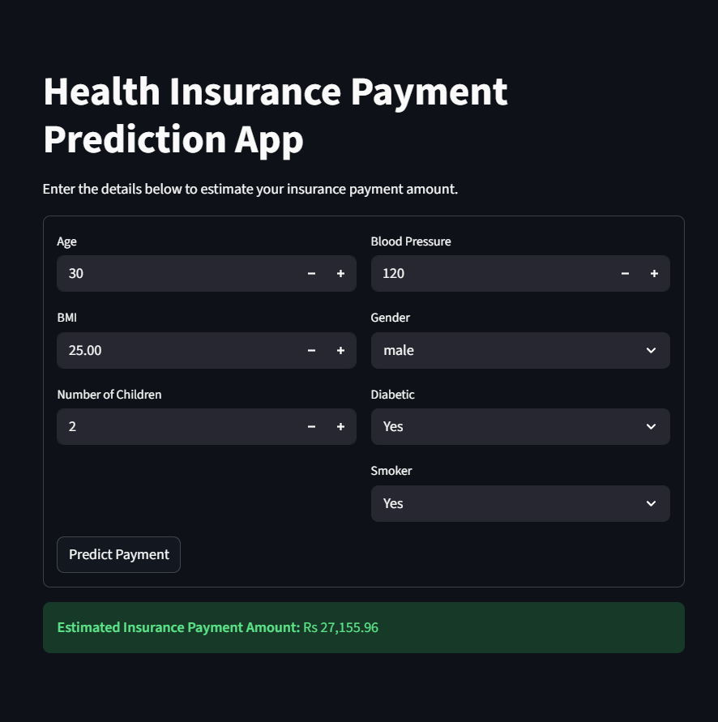
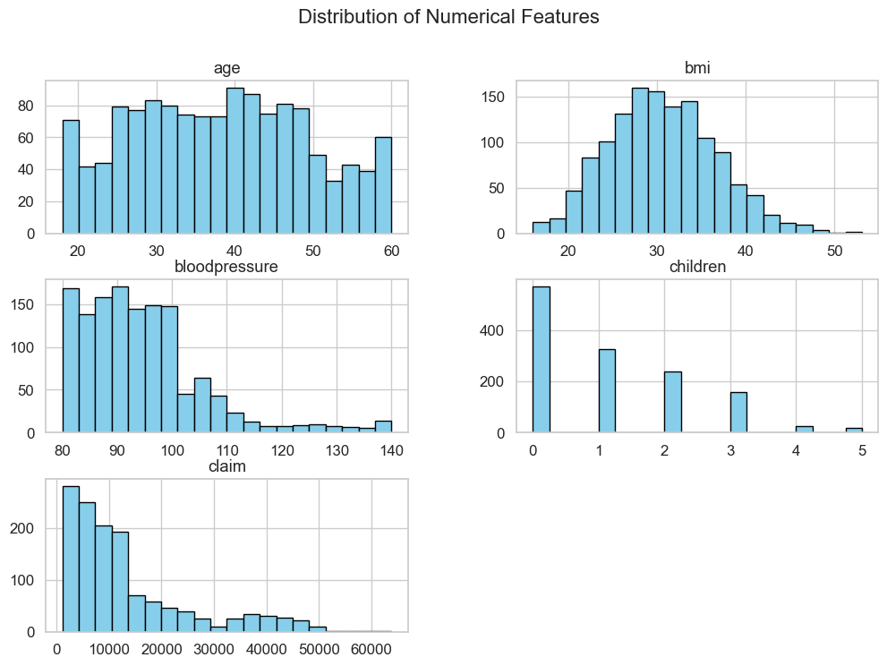
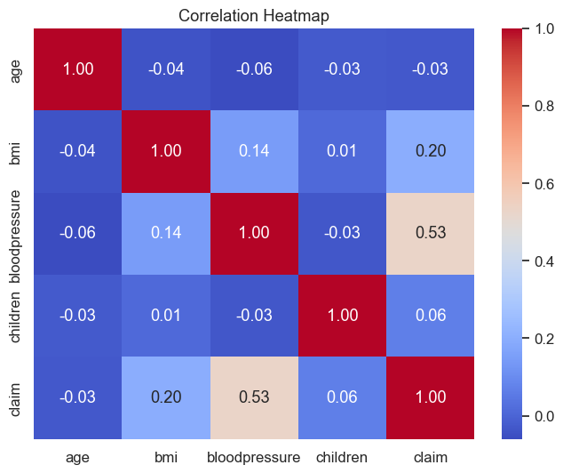
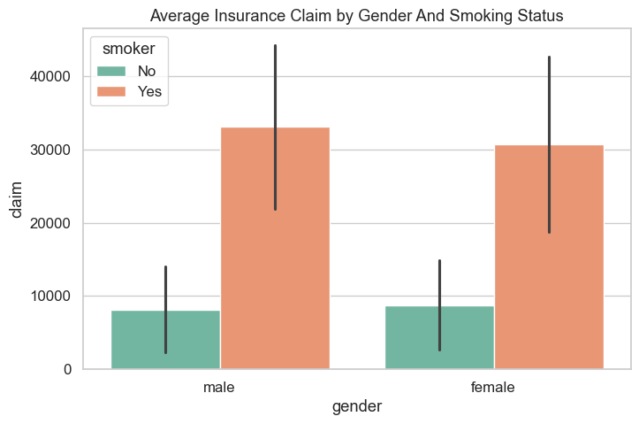
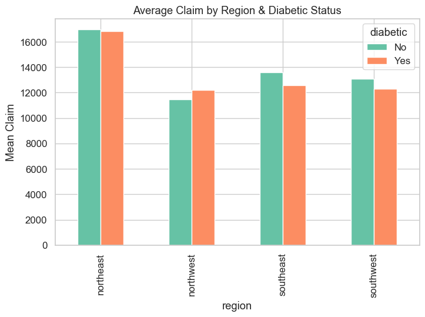
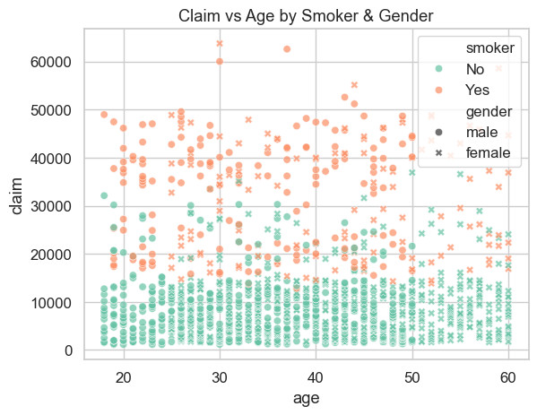
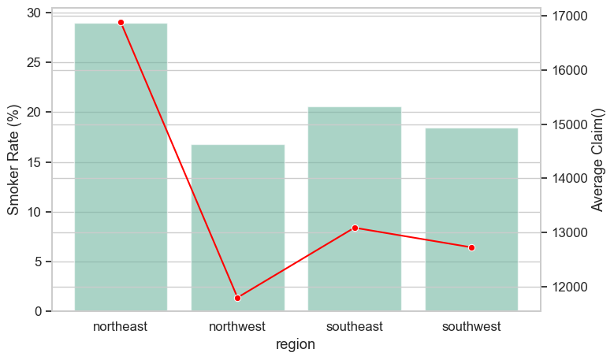

## 📊 Exploratory Data Analysis

### Distribution of Numerical Features

### Correlation Heatmap

### Average Insurance Claim by Gender and Smoking Status

### Average Insurance by Region and Diabetic Status

### Claim vs Age by Smoker and Gender

### Smoke Rate % and Average Claims

